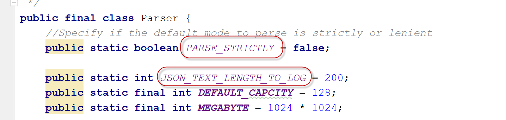
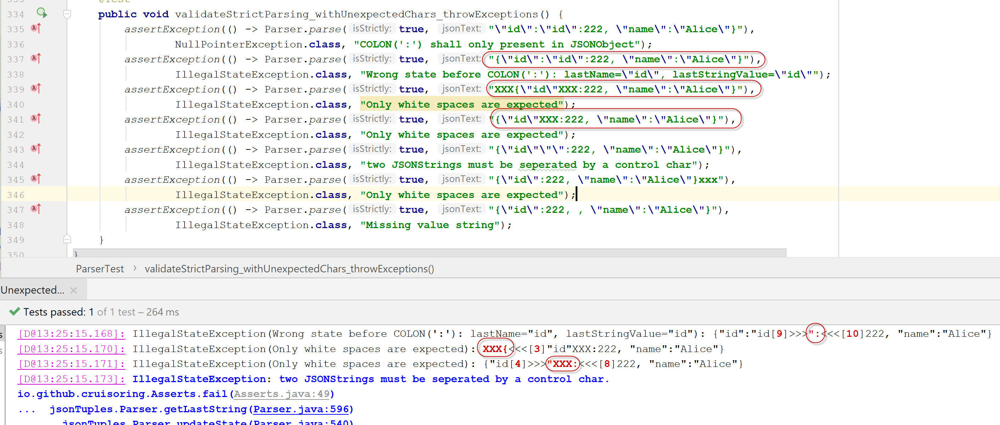
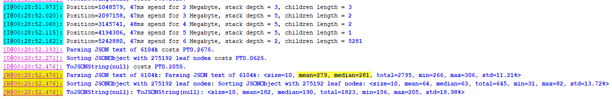
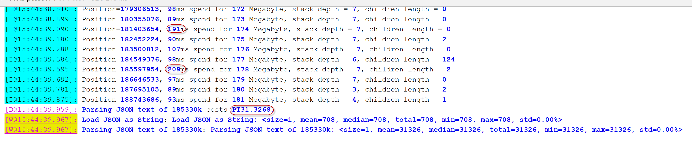
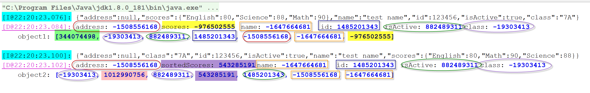
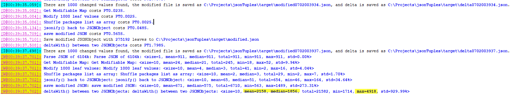

# jsonTuples: JSON Parser and Comparator


The jsonTuples library parses JSON text to immutable JSON values, which can then be converted to List or Map for CRUD operations then back to JSON values. As an unique feature, jsonTuples can compare two JSON texts, or compare ANY two JAVA Objects to get their minimum deltas in seconds.

## Background

Before this project, inspired with the concepts of [Functional Programming paradigm](https://en.wikipedia.org/wiki/Functional_programming), another JAVA library [functionExtensions](https://github.com/Cruisoring/functionExtensions) was published to [make data immutable](https://github.com/Cruisoring/functionExtensions/tree/master/src/main/java/io/github/cruisoring/tuple), [refer Java methods without caring if they throw Exceptions or not](https://github.com/Cruisoring/functionExtensions/tree/master/src/main/java/io/github/cruisoring/throwables), and enable complex business logic based on [Map based Run-time evaluation](https://github.com/Cruisoring/functionExtensions/tree/master/src/main/java/io/github/cruisoring/repository).

When I tried to developed a prototype REST API testing framework by using given JSON texts as templates to compose requests or match responses automatically, I found the JSON parsers available are either too complex to setup, or not fast or convenient enough to convert JSON to/from JAVA objects as I have expected. Considering the simplicity of JSON syntax, I tried to implement this JSON parser with a simplified Class architecture over **Tuple** from the **functionExtensions library** to exploit the benefits of Pure function and Immutable objects. Once the JSON Parser was done, I tried to find a way to compare two JSON texts to get their minimum differences. Thanks god, this exploring attempt turned out to be satisfactory by comparing two big JAVA objects in seconds to get the deltas.

## Get Started

Add the following dependency to your pom.xml:
```xml
<dependency>
    <groupId>io.github.cruisoring</groupId>
    <artifactId>jsonTuples</artifactId>
    <version>1.0.0</version>
</dependency>
```

Alternatively, you can get the package from [Maven Central](http://repo1.maven.org/maven2/io/github/cruisoring/jsonTuples/1.0.0/) directly.

## Mapping between JSON values and JAVA Objects

The **JSON values** here refer to classes/interfaces defined in jsonTuples project, JAVA Objects means common JAVA types like **primitive values or objects, as well as generic Map, Collection and Arrays**.

The jsonTuples is implemented based on the information from [json.org](http://www.json.org/) with direct mappings between JSON values (or interfaces/classes defined in jsonTuples) and JAVA Objects below:

| Interfaces | Classes | | JAVA Object embedded | JSON sample | Notes |
| --- | --- | --- | --- | --- | --- |
|IJSONValue&lt;T&gt; | JSONValue&lt;T&gt; | **Null** | null | *null* | Case sensitive, thus *NULL* is not accepted |
| | |**True** | true| *true*| Case sensitive, thus *True* is not accepted |
| | |**False**| false | *false*| Case sensitive, thus *FALSE* is not accepted |
| | |**JSONString** | String | \"A string\"| special chars like \'\\n\' or \'\\t\' would be trimmed by default | 
| | |**JSONNumber** | Integer, BigInteger, Double, BigDecimal | *123.45e5* | the actual Object saved doesn't affect equals() which would compare by toString\(\)  |
|IJSONValue&lt;*NamedValue*&gt;, **Map&lt;String, Object&gt;**| **JSONObject** | | Map&lt;String, Object&gt; |\{\"id\":12,\"name\":\"Tom\"\}| JSONObject has implemented **Map&lt;String, Object&gt;**, the **NamedValue** is used internally | 
|IJSONValue&lt;*IJSONValue*&gt;, **List&lt;Object&gt;**| **JSONArray** | | Object\[\] |\[null,true,1,\"abc\",\{\},\[\]\]| JSONArray can hold any number of IJSONValue |

All these types extend the generic [Tuple](https://github.com/Cruisoring/functionExtensions/blob/master/src/main/java/io/github/cruisoring/tuple/Tuple.java) type and are thus immutable.

The major interface defined here is **IJSONValue** for any JSON values with solid meanings except **[NamedValue](https://github.com/Cruisoring/JsonTuples/blob/master/src/main/java/jsonTuples/NamedValue.java)** that is similar to *[Map.Entry](https://docs.oracle.com/javase/8/docs/api/java/util/Map.Entry.html)* and used as building blocks of **JSONObject** by assigning a **JSONValue** with a name of **JSONString**.

Of the 7 types represented by **IJSONValue**, the first 5 simple types (**Null, True, False, JSONString, JSONNumber**) are referred as leaf nodes, since their JAVA counterparts cannot be split further, while **JSONObject** and **JSONArray** contain zero to multiple of them, the *IJSONable.getLeafCount()* reflects how many leaf nodes it has by counting the occurrence of the first 5 simple types.

The two major JSON values are **JSONObject** and **JSONArray** that could be treated as JAVA *Map<String, Object>* and *Collection&lt;Object&gt;* or *Object[]* naturally. Under the hood, the *JSONObject* retains the orders of its elements with *LinkedHashMap*.

## Parsing JSON text and consuming the parsed JSON values

The *jsonTuples* can parse given JSON texts to any of the 7 types **IJSONValue**s in above table. Then calling the **getObject()** or **asMutableObject()** would return the contained JAVA values as immutabel or mutable JAVA Objects for convenient processing.

### APIs used to parse JSON text

Constructors of all above JSON values in bold (**Null, True, False, JSONString, JSONNumber, JSONObject and JSONArray**) are protected, and would be created by calling following APIs:
  * The strict JSON Syntax checking is not activated by default.
  * Static methods to parse a given String or part of a CharSequence to specific type of IJSONValue:  
    * __*IJSONValue Parser.parse(CharSequence)*__: generate IJSONValue based on the given JSON text content. If the JSON text is of right syntax, the _IJSONValue_ result shall be casted to one of **Null, True, False, JSONString, JSONNumber, JSONObject or JSONArray**.
    * __*JSONString.parseString(String jsonText)*__: the given jsonText must be wrapped by a pair of quotation marks (").
    * __*JSONValue.parse(CharSequence, Range)*__: expect and parse a part of the given JSON context as one of **Null, True, False, JSONString, JSONNumber**.
    * __*JSONObject.parse(String valueString)*__: expect the *valueString* is enclosed by '{' and '}', and cast the result of __*Parser.parse()*__ to be **JSONObject**.
    * __*JSONArray.parse(String valueString)*__: expect the *valueString* is enclosed by '[' and ']', and cast the result of __*Parser.parse()*__ to be **JSONArray**.
  * Static method __*IJSONValue jsonify(Object object)*__ of _Utilities.java_ is the only API used to convert JAVA Objects to JSON values defined in jsonTuples, it would check the type of the given object to call a method above. For types not covered above, by default the  __*asJSONStringFromOthers(Object object)*__ would be called to generate a JSONString, but it is possible to inject serialization/de-serialization methods into __*Utilities.classConverters*__ that is a Map<Class, Tuple2> where the value of a given class includes both serialization and de-serialization for a concerned type of object, then the serialization method would be called to convert the matched instance to its text equivalent.  
    
The above methods have multiple variations to accept optional arguments.

### Basic example of parsing JSON text

There is no config needed before calling the static methods. The unit test below shows how __*IJSONValue Parser.parse(CharSequence)*__ can be used to parse different text to corresponding IJSONValue types.
```java
    @Test
    public void parseText_getRightIJSONValue() {
        //parse texts of null, true or false
        assertAllTrue(JSONValue.Null == Parser.parse(false, "null"));
        assertAllTrue(JSONValue.True == Parser.parse(false, "true"));
        assertAllTrue(JSONValue.False == Parser.parse(false, "false"));

        //text of a number to JSONNumber
        JSONNumber number = (JSONNumber) Parser.parse(false, " 12.345  ");
        assertEquals(12.345, number.getObject());

        //text enclosed by '""s would be parsed as JSONString
        JSONString string = (JSONString) Parser.parse(false, "  \" abc \n \t\"\r");
        assertEquals(" abc  ", string.getObject());

        //If JSONString.forbidUnescapedControls is set to false, then special characters like \n, \r would not be removed
        try {
            Revokable.register(() -> JSONString.forbidUnescapedControls, v -> JSONString.forbidUnescapedControls = v, false);
            string = (JSONString) Parser.parse(false, "  \" abc \n \t\"\r");
            assertEquals(" abc \n \t", string.getObject());
        }finally {
            Revokable.revokeAll();
        }

        //Map alike text would be parsed as JSONObject
        JSONObject object = (JSONObject) Parser.parse(false, 
                "{\"id\":123,\"name\":null,\"courses\":[\"English\", \"Math\", \"Science\"]}");
        assertEquals(123, object.get("id"));
        assertAllNull(object.get("name"));
        assertEquals(new Object[]{"English", "Math", "Science"}, object.get("courses"));

        //Array alike text would be parsed as JSONArray
        JSONArray array = (JSONArray) Parser.parse(false, "[1, null, true, \"abc\", [false, null], {\"id\":123}]");
        assertEquals(1, array.get(0));
        assertAllTrue(
                array.size() == 6,
                array.contains(null),
                array.containsAll(Arrays.asList(true, "abc"))
        );
        assertEquals(new Object[]{false, null}, array.get(4));
        Map mapAt5 = (Map)array.get(5);
        assertEquals(123, mapAt5.get("id"));
    }
```

_The *assertTrue()*, *assertEquals()* are helper methods added in [Asserts.java of functionExtensions 2.1.0](https://github.com/Cruisoring/functionExtensions/blob/master/src/main/java/io/github/cruisoring/Asserts.java) to assert multiple expressions or compare elements of two Arrays or Collections._

The above test illustrates how **JSONObject** can be referred as a **Map<String, Object>** while **JSONArray** can refer its elements as a **List**. However, all WRITE operations on them would get __*UnsupportedOperationException*__ due to the immutable nature inherited from **Tuple**. 

### Parsing in Lenient or Strict mode with error highlighted

By assuming the JSON texts to be syntax correct, the Parser would work in lenient mode by default to get a bit higher throughput and neglect any errors that bring no ambiguities, as the unit test below:
```
    @Test
    public void validateLenientParsing_withUnexpectedChars_ignoreIfNoConfusion() {
        assertEquals("{\"id\":222,\"name\":\"Alice\"}",
                Parser.parse(false, "XXX{\"id\"XXX:222, \"name\":\"Alice\"}").toJSONString(null));
        assertEquals("{\"id\":222,\"name\":\"Alice\"}",
                Parser.parse(false, "XXX{\"\":\"id\":222, \"name\":\"Alice\"}XXX").toJSONString(null));
        assertEquals("{\"id\":222,\"name\":\"Alice\"}",
                Parser.parse(false, "{XXX\"id\":222, XXX \"name\":\"Alice\"}").toJSONString(null));
        assertEquals("{\"id\":222,\"name\":\"Alice\"}",
                Parser.parse(false, "{\"id\":222,  \"name\":\"Alice\"}, null").toJSONString(null));
    }
```
_Notice there are many illegal **XXX**s would be neglected when people can still "guess" out the intended content._

On the other hand, it is possible to enforce more strict syntax checking by calling _*IJSONValue parse(boolean isStrictly, CharSequence jsonText)*_ with "**isScritly**=true" *(with a overhead of 1-5%)*, then the same JSON texts would cause errors thrown:
```
    @Test
    public void validateStrictParsing_withUnexpectedChars_throwExceptions() {
        assertException(() -> Parser.parse(true, "\"id\":\"id\":222, \"name\":\"Alice\"}"),
                NullPointerException.class, "COLON(':') shall only present in JSONObject");
        assertException(() -> Parser.parse(true, "{\"id\":\"id\":222, \"name\":\"Alice\"}"),
                IllegalStateException.class, "Wrong state before COLON(':'): lastName=\"id\", lastStringValue=\"id\"");
        assertException(() -> Parser.parse(true, "XXX{\"id\"XXX:222, \"name\":\"Alice\"}"),
                IllegalStateException.class, "Only white spaces are expected");
        assertException(() -> Parser.parse(true, "{\"id\"XXX:222, \"name\":\"Alice\"}"),
                IllegalStateException.class, "Only white spaces are expected");
        assertException(() -> Parser.parse(true, "{\"id\"\"\":222, \"name\":\"Alice\"}"),
                IllegalStateException.class, "two JSONStrings must be seperated by a control char");
        assertException(() -> Parser.parse(true, "{\"id\":222, \"name\":\"Alice\"}xxx"),
                IllegalStateException.class, "Only white spaces are expected");
        assertException(() -> Parser.parse(true, "{\"id\":222, , \"name\":\"Alice\"}"),
                IllegalStateException.class, "Missing value string");
    }
```

By changing the static variable of *Parser.PARSE_STRICTLY* to **true** to turn off the default lenient parsing, calling _*IJSONValue parse(CharSequence jsonText)*_ would enforce the strict syntax checking automatically.



When there is syntax errors found when parsing in either lenient or strict mode, the problematic text would be highlighted for further correction:



### Stringify JSON values with indent instruction

In the **IJSONable** interface that is the super interface of **IJSONValue**, the **indent** argument within **String toJSONString(String indent)** determines how to generate string representation of an IJSONValue instance:
 *  Empty String (**""**) would result in the common indented beautiful form that is easy to identify the layered structure of JSON elements, the "toString()" would produce same things.
 *  **null** would produce the most condensed form: all SPACEs out of JSONString would be removed.
 *  Other String composed of WhiteSpaces (like "  ") only would fill each lines of the Strings with the specified leading SPACEs.

The unit test below shows how it works:
```
    @Test
    public void toJSONString() {
        JSONObject obj = JSONObject.parse("{ \"age\": 123, \"other\": \"none\", \"name\": null }");
        assertEquals("{\"age\":123,\"other\":\"none\",\"name\":null}", obj.toJSONString(null));
        assertEquals("{\n  \"age\": 123,\n  \"other\": \"none\",\n  \"name\": null\n}", obj.toJSONString(""));
        assertEquals("{\n    \"age\": 123,\n    \"other\": \"none\",\n    \"name\": null\n  }", obj.toJSONString("  "));
        assertEquals("{\n      \"age\": 123,\n      \"other\": \"none\",\n      \"name\": null\n    }", obj.toJSONString("    "));
    }
 ```

_Since JSON texts representing Map or Array are used most, __*JSONObject.parse(String valueString)*__ and __*JSONArray.parse(String valueString)*__ act as syntactic sugar to cast the IJSONValue to JSONObject or JSONArray behind the scene._

### Accessing parsing result as JAVA Objects

As shown in the basic parsing example, the parsed *JSONArray* and *JSONObject* can be accessed as immutable **List&lt;Object&gt;** and **Map&lt;String, Object&gt;** respectively by calling the **Object getObject()** defined in **IJSONValue** interface, and the **Object** returned would composed by common JAVA objects (nulls, Booleans, Strings, Numbers and combinations of them as Arrays or Maps), but they cannot be modified. 

To perform CRUD operations, the **Object asMutableObject()** of *IJSONValue* shall be called to get the modifiable versions like the example below suggested:
```
    @Test
    public void testAsMutableObject_canBeUpdated() {
        JSONObject obj = JSONObject.parse("{ \"age\": 123, \"other\": \"none\", \"name\": null, \"members\":[\"Alice\", \"Bob\"] }");
        Map<String, Object> map = (Map<String, Object>)obj.asMutableObject();
        assertEquals(123, map.get("age"));
        assertEquals(null, map.get("name"));
        map.put("age", 23);
        map.remove("name");
        List members = (List)map.get("members");
        members.remove("Alice");
        members.add(0, "Alan");
        members.add("Carter");

        JSONObject updated = Utilities.asJSONObject(map);
        assertEquals("{\"age\":23,\"other\":\"none\",\"members\":[\"Alan\",\"Bob\",\"Carter\"]}", updated.toJSONString(null));
    }
```

At the end of the above codes, the **Utilities.asJSONObject(map)** would turn the JAVA Map to a **JSONObject** that might be suitable for big JAVA Objects. For small ones, as you can find from the unit tests of this project, I tend to initialize a Map or List by parsing a String, then calling getObject() would save some typings.

### Convert any JAVA Objects to IJSONValues

As the above example illustrated, the **Utilities.asJSONObject(Object)** would convert a JAVA Map to a JSONObject, a more generic API is **IJSONValue jsonify(Object object)**. By default, it enables following conversions in order:
 *  JAVA **null** to **JSONValue.Null**;
 *  An **IJSONValue** instance to itself directly;
 *  JAVA **true**/**false** to **JSONValue.True** or **JSONValue.False** respectively;
 *  JAVA **String** Objects to **JSONString** Objects;
 *  JAVA **Number** Objects to **JSONNumber** Objects;
 *  JAVA **Map** to **JSONObject**;
 *  JAVA **Collection** or **Array** to **JSONArray**;
 *  For unknown types of JAVA Objects, **JSONString** would be used to represent their **toString()**.
 
You might have noticed that converting unknown JAVA objects to their toString()s is not quite reasonable, that is mainly due to missing something like AutoMapper to serialize/deserialize JAVA classes to/from JSON Strings that is out of the scope of this project, but the following unit test shows how it can be supported if helper methods are defined:
```
    public class Student{
        public String name;
        public int age;
        public Student(String name, int age){
            this.name = name;
            this.age = age;
        }
        public String toJSON() {
            return String.format("{\"name\":\"%s\", \"age\":%d}", name, age);
        }
    }

    @Test
    public void testJsonify_withStudentInstances(){
        FunctionThrowable<Object, IJSONValue> studentToJSON = student -> Parser.parse(((Student)student).toJSON());
        Utilities.classConverters.put(Student.class, Tuple.create(studentToJSON, null));
        Map studentInClass = new HashMap(){{
            put("year", "Year7");
            put("active", true);
            put("students", Arrays.asList(
                    new Student("Alice", 12),
                    new Student("Bob", 13)
            ));
        }};
        assertEquals("{\"year\":\"Year7\",\"active\":true,\"students\":[{\"name\":\"Alice\",\"age\":12},{\"name\":\"Bob\",\"age\":13}]}",
                Utilities.jsonify(studentInClass).toJSONString(null));
    }
```

Though not in the scope of jsonTuples, if there is a AutoMapper alike library to parse the POJOs in your working projects, then it shall be quite convenient to handle literately any JAVA objects to and from JSON texts.

### Performance of jsonTuples

Unlike other JSON parsers, the jsonTuples applies a simplified high-level state-machine to process the characters of JSON text under parsing in three steps:
1)  Delimit the scopes of Strings enclosed by QUOTEs(**"**), and neglect any chars inside including the escaped QUOTEs that are behind of an opening (**"**) with BACK-SLASH(**\\**) ahead, extract any **JSONString**s directly.
2)  Neglect all chars except control chars used in JSON (that is LEFT_BRACE('**{**'), RIGHT_BRACE('**}**'), LEFT_BRACKET('**\[**'), RIGHT_BRACKET('**]**'), COMMA('**,**'), COLON('**:**')), perform strict syntax checking if needed.
3)  Only the above control chars would be fed into a state-machine to harvest the parsed results recursively with only the previous control char considered.

Unless there is any syntax error encountered and then the Parser needs to revisit the start of the text causing the error, the processing of JSON text would hardly revisit the previous content before the last control, and even the control chars identified earlier would be consumed without evaluating for second time.

When running the unit test below from my 4-cores i7-7700HQ @ 2.8G laptop to parse the 6.1M JSON text 10 times:
```
    @Test
    public void test6104KJson() {
        String jsonText = ResourceHelper.getTextFromResourceFile("catalog.json");
        int jsonTextLength = jsonText.length();

        String sortedString = null;
        for (int i = 0; i < 10; i++) {
            JSONObject result = Logger.M(Measurement.start("Parsing JSON text of %dk", jsonTextLength/1024),
                    () -> (JSONObject) Parser.parse(false, jsonText));
            int leafCount = checkNotNull(result, "Failed to parse the JOSN text.").getLeafCount();
            IJSONValue sortedValue = Logger.M(Measurement.start("Sorting JSONObject with %d leaf nodes", leafCount),
                    () -> result.getSorted(Comparator.naturalOrder()));
            sortedString = Logger.M(Measurement.start("ToJSONString(null)"), () -> sortedValue.toJSONString(null));
        }
        Measurement.purge(LogLevel.warning);
    }
```

The screenshot below shows the average and max time to parse the 6.1M file are __*279ms and 306ms*__ respectively: almost 20M/s throughput for such middle-sized JSON texts.



It is not so ideal when parsing huge JSON file. For the [181M JSON file](https://raw.githubusercontent.com/zemirco/sf-city-lots-json/master/citylots.json), if you save it as "C:\temp\citylots.json", then the following test:
```
    @Test @Ignore
    public void test181MJson() {
        String jsonText = Logger.M(Measurement.start("Load JSON as String"), () -> ResourceHelper.getTextFromResourceFile("c:/temp/citylots.json"));
        int jsonTextLength = jsonText.length();

        String sortedString = null;
        JSONObject result = Logger.M(Measurement.start("Parsing JSON text of %dk", jsonTextLength / 1024),
                () -> (JSONObject)Parser.parse(true, jsonText));
        assertNotNull(result, "Failed to parse the JSON text.");
        Measurement.purge(LogLevel.warning);
    }
```

The logging shows it might take 2-4 seconds to process 1 Megabyte payload intermittently that might happen because of JAVA Garbage collections. Though running the same test from a slow PC with 8G memory only would crash the JVM when it took exponentially longer time to process 1 Megabytes after 100M, as shown in the [log](images/Parse 181M JSON from PC with 8G Mem.txt), the jsonTuples shall be responsive enough to handle JSON of normal sizes.



## Comparing two IJSONValues or Comparing two JAVA Objects

After implementing the parsing functions, I started to exploit the possibility of comparing two **IJSONValue** instances to show their differences. It turned out to be more difficult than implementing the parsing.

### Scenarios to be compared

Actually it is not always difficult, the combinations of **IJSONValue**s to be compared can be classified as following scenarios:
1) Between simple **IJSONValue** types, namely **Null, True, False, JSONString, JSONNumber** that are also leaf nodes of compose any JSON content, comparing their toString() would be fair enough, so:
    * Thus **JSONNumber(null)** or **JSONString(null)** would be equal to **JSONValue.Null**.
    * The **JSONNumber(Integer.valueOf(1))** would be equal to **JSONNumber(1L)**.
2) Between different types of **IJSONValue**, like comparing an **JSONNumber** with an **JSONString**, or **JSONObject** vs **JSONArray**, then a **JSONArray** composed by these two **IJSONValue** instances would explain everything.
3) Between two **JSONObject** instances, their names, like the keys of two Maps, can associate their entries easily to allow further comparisons of the corresponding values.
4) Between two **JSONArray** instances, now comes the interesting part:
    * If the positions of their elements matter, then it is straight-forward like comparing two **JSONObject** instances with their positions as the implicit keys.
    * _**If the positions of their elements doesn't matter, then binding their elements to get the least difference sets before further comparing.**_
  
The first 3 and half scenarios are quite simple and worth no discussions, but the last case of comparing two **JSONArray** instances when their orders are neglected is the real challenge, especially when both of them contain hundreds or thousands of similar elements. However, I believe it is also quite using when considering them as two Sets, or two Lists created from identical sets of elements when one of the them get one or several elements in the middle removed.
 
### Immutable Tuples with immutable hashCodes and signatures

The [Tuple classes defined in functionExtensions](https://github.com/Cruisoring/functionExtensions/tree/master/src/main/java/io/github/cruisoring/tuple) are extended to summarize its contents as a set of Integers. 

Since these strong-typed Objects whose constructors accept only arguments decorated with **final**, their elements shall be immutable with fixed orders **IF** extended properly, thus their and their children's hashCodes are also fixed thus can be buffered as **Set<Integer>** that could be the least-cost items to be compared in JAVA.

An unit test shows how the **getSignatures()** inherited from *Tuple* can reveal the common points and potential differences of two *JSONObject*s:
```
    @Test
    public void testGetSignatures() {
        String text = "{\"address\": null, \"scores\": {\"English\":80,\"Science\":88,\"Math\":90}, \"name\": \"test name\" ,\"id\" :123456, \"isActive\": true, \"class\": \"7A\"}";
        JSONObject object1 = JSONObject.parse(text);
        NamedValue address = object1.getValue(0);
        NamedValue scores = object1.getValue(1);
        NamedValue name = object1.getValue(2);
        NamedValue id = object1.getValue(3);
        NamedValue isActive = object1.getValue(4);
        NamedValue classNamedValue = object1.getValue(5);

        Set<Integer> signature1 = object1.getSignatures();
        Logger.I(object1.toJSONString(null));
        Logger.D("address: %s\tscores: %s\tname: %s\tid: %s\tisActive: %s\tclass: %s\n\tobject1: %s\n",
                address.hashCode(), scores.hashCode(), name.hashCode(), id.hashCode(), isActive.hashCode(), classNamedValue.hashCode(), deepToString(signature1));
        assertAllTrue(signature1.size() == 7,
                signature1.containsAll(Arrays.asList(object1.hashCode(), address.hashCode(), scores.hashCode(), name.hashCode(), id.hashCode(), isActive.hashCode(), classNamedValue.hashCode())));

        JSONObject object2 = object1.getSorted(Comparator.naturalOrder());
        Logger.I(object2.toJSONString(null));
        Set<Integer> signature2 = object2.getSignatures();
        NamedValue sortedScores = NamedValue.parse("\"scores\": {\"English\":80,\"Math\": 90,\"Science\": 88}");
        Logger.D("address: %s\tsortedScores: %s\tname: %s\tid: %s\tisActive: %s\tclass: %s\n\tobject2: %s\n",
                address.hashCode(), sortedScores.hashCode(), name.hashCode(), id.hashCode(), isActive.hashCode(), classNamedValue.hashCode(), deepToString(signature2));
        assertAllTrue(signature2.size() == 7,
                signature2.containsAll(Arrays.asList(object2.hashCode(), address.hashCode(), name.hashCode(), id.hashCode(), isActive.hashCode(), classNamedValue.hashCode())),
                signature2.contains(sortedScores.hashCode()));
    }
```

Its output is marked with different colors to highlight why it is called signatures:



The *object1* and *object2* share same set of *NamedValue*s except the embedded *JSONObject* identified by *scores*, by comparing their signatures along, it is quite easy to see that pair of elements shall be compared together while other pairs identified by *address*, *name*, *id* and ect would concluded as no differences quickly.

Checking the two pairs of *scores* JSONObjects, clearly they are referring same thing if defined as JAVA Maps, wasting time to compare these *JSONObject* with same elements of different orders would be a waste of time, that is why comes the sorting that is usually not supported by JSON Parsers.

### Sorting with StringComparator

The **ISortable getSorted(Comparator<String>)** method inherited by *IJSONValue* wold re-arrange the elements of *JSONObject* with desirable orders, and it would also be used by the *JSONArray* to pass to all its children *JSONObject*s. Consequently, two *JSONObject*s or *JSONArray*s sharing the same **Comparator<String** to sorting the names of their *JSONObject* would represent their children of same elements with identical signatures. 

To ensure a preferred order or retain the original orders of the embedded **JSONObject**s, an __*OrdinalComparator*__ can be constructed easily and supplied to either *Parser.parse(...)* or *IJSONValue.getSorted(Comparator<String>)* to get **array3**, which would be shown as:
```text
    @Test
    public void getSortedWithOrderedNames() {
        JSONObject obj = JSONObject.parse("{ \"age\": 123, \"name\": null, \"other\": \"none\" }");
        JSONObject naturalOrdered = (JSONObject) obj.getSorted("name", "other");
        String string = naturalOrdered.toString();
        assertEquals("{\n" +
                "  \"name\": null,\n" +
                "  \"other\": \"none\",\n" +
                "  \"age\": 123\n" +
                "}", string);

        JSONObject naturalReversed = obj.getSorted(naturalOrdered.nameComparator.reversed());
        string = naturalReversed.toString();
        assertEquals("{\n" +
                "  \"age\": 123,\n" +
                "  \"other\": \"none\",\n" +
                "  \"name\": null\n" +
                "}", string);
    }
```

### Get least different pairs when orders neglected

To compare two **JSONArray**s when their elements order doesn't matter, the logic behind would use the signatures to pair elements by finding out the least different pairs that is a quite complex procedure with acceptable performance.

The following test would load the 6M JSON file, change 1000 of its leaf nodes, then compare their differences for 10 times:
```
    @Test @Ignore
    public void testDeltaWith_ofLargeObjects() {
        String jsonText = ResourceHelper.getTextFromResourceFile("catalog.json");
        int changes = 1000;
        int jsonTextLength = jsonText.length();
        JSONObject original = Logger.M(Measurement.start("Parse JSON of %dk", jsonTextLength/1024), () -> JSONObject.parse(jsonText));
        int originalLeafCount = original.getLeafCount();

        try(Revokable revokable = Logger.setLevelInScope(LogLevel.debug)) {
            for (int i = 0; i < 10; i++) {
                Map<String, Object> modifiableMap = (Map<String, Object>) Logger.M(Measurement.start("Get Modifiable Map"), () -> original.asMutableObject());
                Object packagesList = modifiableMap.get("packages");

                Logger.M(Measurement.start("Modify %d leaf values", changes), () -> modifyAndShuffle(packagesList, changes));

                Object shuffledArray = Logger.M(Measurement.start("Shuffle packages list as array"), () -> ArrayHelper.shuffle(((List) packagesList).toArray()));
                modifiableMap.put("packages", shuffledArray);
                JSONObject modifiedObject = Logger.M(Measurement.start("jsonify() back to JSONObject"), () ->(JSONObject) Utilities.jsonify(modifiableMap));
                int modifiedLeafCount = modifiedObject.getLeafCount();
                Logger.D("Save modified JSONObject with %d leaves to %s", modifiedLeafCount,
                        Logger.M(Measurement.start("save modified JSON"), () ->ResourceHelper.saveTextToTargetFile(modifiedObject.toString(), "modified.json")));

                IJSONValue delta = Logger.M(Measurement.start("deltaWith() between Object with %d leafs and another with %d leafs", originalLeafCount, modifiedLeafCount),
                        () -> original.deltaWith(modifiedObject, "pos"));
                assertNotNull(delta, "Failed to get result.");
                String deltaString = delta.toString();
                Matcher matcher = Pattern.compile("changedValue\\d{3}").matcher(deltaString);
                int count = 0;
                while (matcher.find()){
                    count++;
                }

                String timeStamp = DateTimeHelper.asString(LocalDateTime.now(), "MMddHHmmss");
                String modifedFile = ResourceHelper.saveTextToTargetFile(modifiedObject.toString(), String.format("modified%s.json", timeStamp));
                String deltaFile = ResourceHelper.saveTextToTargetFile(delta.toString(), String.format("delta%s.json", timeStamp));
                Logger.I("There are %d changed values found, the modified file is saved as %s, and delta is saved as %s.", count, modifedFile, deltaFile);
            }
        }finally {
            Measurement.purge(LogLevel.warning);
        }
    }
```

The output from my laptop shows it usually take 2-3 seconds to identify all 1000 differences by comparing two JSONObjects with 275K leaf nodes.



### Comparing two IJSONValues with optional instruction

The **IJSONValue deltaWith(IJSONValue other, String indexName)** defined in **IJSONValue** accepts a String parameter to instruct how to compare:
 *  When indexName is **null**, then the *JSONArray*s would be converted to *JSONObject*s with their index as the names explicitly.
 *  Otherwise, when indexName is not **null**, then the positions of their elements would not affect how they are paired to compare:
    *  When indexName is **""**, that is also the default setting of **JSONArray.defaultIndexName**, would shows only the differences without their position information.
    *  When indexName is a String containing **+**, would not only shows the differences of paired elements with their indexes, but also shows the index differences of identical elements at different positions.
    *  Otherwise, only shows the differences of paired elements with their indexes.
    
There are many unit tests created and one example is below:
```
    @Test
    public void compareTwoArrays_difSizeWithElementDifferences_returnNonEmpty(){
        JSONArray array = new JSONArray(alice, bob, ellen);
        JSONArray array2 = new JSONArray(
                alice.withDelta("{\"age\":13,\"class\":\"7F\"}"),
                ellen
        );
        Logger.D("array2: %s", array2);
        IJSONable delta1 = array.deltaWith(array2, "");
        IJSONable delta2 = array2.deltaWith(array, "index");
        IJSONable delta3 = array2.deltaWith(array, "+pos");
        Logger.D("delta1: %s\ndelta2: %s\ndelta3: %s", delta1, delta2, delta3);

        assertEquals("[{\"age\":[12,13],\"class\":[\"7N\",\"7F\"]},[{\"name\":\"Bob\",\"gender\":\"M\",\"age\":13,\"class\":\"7C\",\"scores\":{\"english\":76,\"science\":62,\"humanity\":62,\"math\":80}},null]]",
                delta1.toJSONString(null));
        assertEquals("[{\"index\":[0,0],\"age\":[13,12],\"class\":[\"7F\",\"7N\"]},{\"-1\":null,\"1\":{\"name\":\"Bob\",\"gender\":\"M\",\"age\":13,\"class\":\"7C\",\"scores\":{\"english\":76,\"science\":62,\"humanity\":62,\"math\":80}}}]",
                delta2.toJSONString(null));
        assertEquals("[{\"+pos\":[0,0],\"age\":[13,12],\"class\":[\"7F\",\"7N\"]},{\"+pos\":[1,2]},{\"-1\":null,\"1\":{\"name\":\"Bob\",\"gender\":\"M\",\"age\":13,\"class\":\"7C\",\"scores\":{\"english\":76,\"science\":62,\"humanity\":62,\"math\":80}}}]",
                delta3.toJSONString(null));
    }
```

### Comparing two JAVA Objects with jsonTuples

Since JAVA Objects can be converted to JSON values by jsonTuples, and these JSON values can be compared to get their differences, there are two static methods defined in the [Utilities.java](https://github.com/Cruisoring/JsonTuples/blob/master/src/main/java/jsonTuples/Utilities.java) to compare two JAVA objects directly:
 *  _*IJSONValue deltaWith(Object obj1, Object obj2, String indexKey)*_: convert both Objects to **IJSONValue**s, then get the delta with strategy identified by the *indexKey*. 
 *  IJSONValue deltaWith(Object obj1, Object obj2): just a simplified version using default **JSONArray.defaultIndexName**.

The unit test below shows how it works:
```
    @Test
    public void testJsonify_withDifferentObjects_getRightIJSONValues(){
        assertEquals(JSONValue.Null, Utilities.jsonify(null));
        assertEquals(JSONValue.False, Utilities.jsonify(false));
        assertEquals(new JSONString("string"), Utilities.jsonify("string"));
        assertEquals(33.4, Utilities.jsonify(33.4).getObject());

        Set<Object> complexSet = new LinkedHashSet<>(Arrays.asList( new Character[]{'a', 'b'}, true, new int[]{1, 2},
                new double[][]{new double[]{-1.2, 0}, new double[]{3.3}}, new Object[]{"OK", null}));
        JSONArray array = (JSONArray) Utilities.jsonify(complexSet);
        Object object = array.getObject();
        assertEquals(new Object[] { new Object[]{"a", "b"}, true, new Object[]{1, 2},
                new Object[]{new Object[]{-1.2, 0d}, new Object[]{3.3}}, new Object[]{"OK", null}}, object);

        Map<String, Object> map = new LinkedHashMap<>();
        map.put("purpose", "test");
        map.put("array", array);
        map.put("other", null);
        JSONObject jsonObject = (JSONObject)Utilities.jsonify(map);
        assertEquals("{\"purpose\":\"test\",\"array\":[[\"a\",\"b\"],true,[1,2],[[-1.2,0.0],[3.3]],[\"OK\",null]],\"other\":null}",
                jsonObject.toJSONString(null));
    }
```

## Conclusion

As a conclusion, following objects have been met to some extents:
 * 	Defines limited JSON classes to enable JSON string processing as outlined in [json.org](http://www.json.org/), especially **JSONObject** and **JSONArray**.
 *  Parses big JSON text block and saves the contents as **JSONObject**/**JSONArray** that are immutable.
 *  Serialize **JSONObject/JSONArray** to JSON text in some different formats.
 *  Sort the orders of JSONObject elements with *StringComparator* recursively to get JSON texts of unified forms.
 *  Convert a Collection or Array to/from JSONArray, or a Map<String, Object> to/from JSONObject with immutable Tuples to keep the data.
 *  The JSON values, like JSONObject and JSONArray, can be converted to modifiable Map<String, Object> or ArrayList for CRUD.
 *  The JSON values can be used as media to compare JAVA Objects to get their minimum differences as another JSON Object. For example, find out the differences between an Array and a Set whose elements may or may not be consistent.

Some desirable features are not included:
 *  Mapping JAVA Classes to / from JSON as [GSON](https://github.com/google/gson) or [Jackson](https://github.com/FasterXML/jackson) is not supported in current version.
 *  Converting JSONObject/JSONArray to customised Map or Collection, they would be mapped to LinkedHashMap and ArrayList for modifications.
 *  Expressions to locate element of JSON, like [JsonPath](https://github.com/json-path/JsonPath) are not supported yet.

For me, working out this library is a really challenging and rewarding experience with guides from God. 

I hope this freeware can help you to solve some real problems associated with JSON or even data analysis.

If it does help you and you are happy, any support to the development of my church [SIC](https://www.sic.org.au/) would be really appreciated:
**A/C Name:** SIC Develmt Fund
**BSB:** 484 799
**A/C No:** 200 198 196

