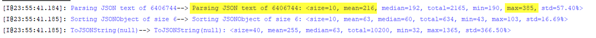

#JsonTuples
===================

Driven by [Functional Programming paradigm](https://en.wikipedia.org/wiki/Functional_programming) and using uses immutable Tuples of [functionExtensions 2.0.0](http://repo1.maven.org/maven2/io/github/cruisoring/functionExtensions/2.0.0/) to keep data, the JsonTuples is a Java library to parse big JSON strings, or converting JAVA Array/Collection/Map to corresponding JSONValues quickly, then the huge data sets embedded can be serialized, sorted or compared so as to be used as a Data Analytic tool.

The original intention of this project is to use given set of JSON texts as templates to compose requests and match responses automatically for REST API testing, that means a fast parser to convert sample REST payloads into common JAVA data structures of Maps or Collections, then part of them could be modified/removed/added easily before converting the updated data back to JSON texts as HTTP GET/POST/PUT/DELETE payloads. By studying available open-source projects to convert JAVA Objects to/from JSON, I realized that there could be steep learning curves, and might not get desirable performance and functions. This library means to expose simple APIs to parse JSON text as Maps, Arrays or combination of them that can be accessed conveniently. Further more, with the embdedded features of Tuple, the JsonTuples can compare huge datasets composed by Collections and Maps to get their deltas effectively.

## Goals

 * 	Defines limited JSON classes to enable JSON string processing as outlined in [json.org](http://www.json.org/), especially JSONObject and JSONArray.
 *  Parses big JSON text block and saves the contents as JSONObject/JSONArray that are immutable.
 *  Serialize JSONObject/JSONArray to JSON text with/without indents.
 *  Sort the orders of JSONObject elements with StringComparator recursively to get JSON texts of unified forms.
 *  Convert a Collection or Array to/from JSONArray, or a Map<String, Object> to/from JSONObject with immutable Tuples to keep the data.
 *  The JSON Objects, like JSONObject and JSONArray, can be converted to modifiable Map<String, Object> or ArrayList for update/insert/delete.
 *  The JSON Objects can be used as media to compare two big datasets to get their minimum differences as another JSON Object. For example, find out the differences between an Array and a Set whose elements may or may not be consistent.

Due to the light-weight nature of this project, following functionalities are not supported:
 *  Mapping JAVA Classes to / from JSON as [GSON](https://github.com/google/gson) or [Jackson](https://github.com/FasterXML/jackson) is not supported in current version.
 *  Converting JSONObject/JSONArray to customised Map or Collection, they would be mapped to LinkedHashMap and ArrayList for modifications.
 *  Expressions to locate element of JSON, like [JsonPath](https://github.com/json-path/JsonPath) are not supported yet.

## Get Started

Add the following dependency to your pom.xml:
```xml
<dependency>
    <groupId>io.github.cruisoring</groupId>
    <artifactId>JsonTuples</artifactId>
    <version>1.0.0</version>
</dependency>
```

Alternatively, get the packages directly from [Maven Central](http://repo1.maven.org/maven2/io/github/cruisoring/JsonTuples/1.0.0/)


## Converting Text/JAVA to/from JSON

The JSON objects refer to classes/interfaces defined in JsonTuples project, JAVA Objects means common JAVA types like primitive objects, as well as generic Map, Collection and Arrays. For the JSON texts to be processed, it is assumed they have followed the correct JSON syntax.

The JsonTuples is implemented based on the information from [json.org](http://www.json.org/) with straight mappings between JsonTuples interfaces/classes and JAVA Objects below:

| Interfaces | Classes | | JAVA Object embedded | JSON sample | Notes |
| --- | --- | --- | --- | --- | --- |
|IJSONValue&lt;T&gt; | JSONValue&lt;T&gt; | **Null** | null | *null* | *NULL* is not accepted |
| | |**True** | true| *true*| *True* is not accepted |
| | |**False**| false | *false*| *FALSE* is not accepted |
| | |**JSONString** | String | \"A string\"| special chars like \'\\n\' or \'\\t\' would be trimmed by default | 
| | |**JSONNumber** | Integer, BigInteger, Double, BigDecimal | *123.45e5* | the actual Object saved doesn't affect equals() which would compare by toString\(\)  |
|IJSONValue&lt;*NamedValue*&gt;| **JSONObject** | | Map&lt;String, Object&gt; |\{\"id\":12,\"name\":\"Tom\"\}| JSONObject has implemented **Map&lt;String, Object&gt;**, the **NamedValue** is used internally | 
|IJSONValue&lt;*IJSONValue*&gt;| **JSONArray** | | Object\[\] |\[null,true,1,\"abc\",\{\},\[\]\]| JSONArray can hold any number of IJSONValue |

The two major JSON objects are **JSONObject** and **JSONArray**. Both of them extend the generic [Tuple](https://github.com/Cruisoring/functionExtensions/blob/master/src/main/java/io/github/cruisoring/tuple/Tuple.java) type and are immutable. JAVA *Map<String, Object>* is the natural equivalent of *JSONObject*, and *Collection<Object>* or *Object[]* can be mapped to JSONArray naturally. The *JSONObject* retains the orders of its elements with *LinkedHashMap*; on the other side, though *JSONArray* keeps the orders of its elements, that order might be ignored considering *Collection*s doesn't care element orders like *Set*.

Constructors of all above JSON objects in bold (**Null, True, False, JSONString, JSONNumber, JSONObject and JSONArray**) are protected, and would be created by:
  * **The JSON Syntax checking is not enforced** by assuming the JSON text supplied to this library comply JSON protocol.
  * Static methods to parse a given String or part of a CharSequence to specific type of IJSONValue:  
    * __*IJSONValue Parser.parse(CharSequence)*__: generate IJSONValue based on the given JSON text content. If the JSON text is of right syntax, the _IJSONValue_ result shall be casted to one of **Null, True, False, JSONString, JSONNumber, JSONObject or JSONArray**.
    * __*JSONString.parseString(String jsonText)*__: the given jsonText must be wrapped by a pair of quotation marks (").
    * __*JSONValue.parse(CharSequence, Range)*__: expect and parse a part of the given JSON context as one of **Null, True, False, JSONString, JSONNumber**.
    * __*JSONObject.parse(String valueString)*__: expect the *valueString* is enclosed by '{' and '}', and cast the result of __*Parser.parse()*__ to be **JSONObject**.
    * __*JSONArray.parse(String valueString)*__: expect the *valueString* is enclosed by '[' and ']', and cast the result of __*Parser.parse()*__ to be **JSONArray**.
  * Static method __*IJSONValue jsonify(Object object)*__ of _Utilities.java_ is the only API used to convert JAVA Objects to JSON Objects defined in JsonTuples, it would check the type of the given object to call a method above. For types not covered above, by default the  __*asJSONStringFromOthers(Object object)*__ would be called to generate a JSONString, but it is possible to inject serialization/de-serialization methods into __*Utilities.classConverters*__ that is a Map<Class, Tuple2> where the value of a given class includes both serialization and de-serialization for a concerned type of object, then the serialization method would be called to convert the matched instance to its text equivalent.  
    
Usually, the above methods shall be enough to get most JSON to/from JAVA conversions done.

## Sort and Format Text from JSON

To display the content held by JSONObject with a ordered manner, a **Comparator<String>** can be used in two ways:
  * Supplied as argument of __*Parser.parse(Comparator<String> comparator, CharSequence jsonText)*__ or __*parse(Comparator<String> comparator, CharSequence jsonText, Range range)*__, then the parsed *JSONObject* and all its children would be saved with orders specified by the given **comparator**.
  * the __*JSONObject.getSorted(Comparator<String> comparator)*__ or __*JSONArray.getSorted(Comparator<String> comparator)*__ would return a new JSONObject or JSONArray with their children elements sorted by names following rules specified by the given **comparator**.
  
As a special case, the [OrdinalComparator](https://github.com/Cruisoring/JsonTuples/blob/master/src/main/java/JsonTuples/OrdinalComparator.java) would register all names of JSON Object in order and sort all names accordingly.

The TAB of indent has been hard-coded as ```"  "``` in **JSONValue.SPACE**, the **toJSONString(String indent)** defined in **IJSONable** interface accepts a blank String that can be either _null_ or all white-spaces to get JSON text based on value of the given **indent**:
  *  If the JSONObject is empty, then it would always return ```{}```;
  *  If the JSONArray is empty, then it would always return ```[]```;
 Otherwise:
  *  If **indent** is null, then the generated JSON text would be a compact single-line String by removing all white-spaces;
  *  If **indent** is ```""```, then the generated JSON text would be a multi-line String with extra ```"  "``` for each indent level.
  *  If **indent** is not empty, then the generated JSON text would be a multi-line String with given **indent** appended ahead of each lines from above case.

The toString() would show same String as if the **indent** is ```""```. Just as the [base Tuple type](https://github.com/Cruisoring/functionExtensions/blob/master/src/main/java/io/github/cruisoring/tuple/Tuple.java), the toString() result is cached for achieve performance benefits that along with cached hashCode, is critical for fast comparison of huge datasets.

## Basic Examples

This section shows how JsonTuples can be used to parse JSON text or convert common JAVA objects to JSON objects.

### Parse Text as JSON Objects

The unit test below shows how __*IJSONValue Parser.parse(CharSequence)*__ can be used to parse different text to corresponding IJSONValue types.
```java
    @Test
    public void parseText_getRightIJSONValue() {
        //parse texts of null, true or false
        assertTrue(JSONValue.Null == Parser.parse("null"));
        assertTrue(JSONValue.True == Parser.parse("true"));
        assertTrue(JSONValue.False == Parser.parse("false"));

        //text of a number to JSONNumber
        JSONNumber number = (JSONNumber) Parser.parse(" 12.345  ");
        assertEquals(12.345, number.getObject());

        //text enclosed by '""s would be parsed as JSONString
        JSONString string = (JSONString) Parser.parse("  \" abc \n \t\"\r");
        assertEquals(" abc  ", string.getObject());

        //Map alike text would be parsed as JSONObject
//        JSONObject object = JSONObject.parse("{\"id\":123,\"name\":null,\"courses\":[\"English\", \"Math\", \"Science\"]}");
        JSONObject object = (JSONObject) Parser.parse("{\"id\":123,\"name\":null,\"courses\":[\"English\", \"Math\", \"Science\"]}");
        assertEquals(123, object.get("id"));
        assertNull(object.get("name"));
        assertEquals(new Object[]{"English", "Math", "Science"}, object.get("courses"));

        //Array alike text would be parsed as JSONArray
//        JSONArray array = JSONArray.parse("[1, null, true, \"abc\", [false, null], {\"id\":123}]");
        JSONArray array = (JSONArray) Parser.parse("[1, null, true, \"abc\", [false, null], {\"id\":123}]");
        assertEquals(1, array.get(0));
        assertTrue(
                array.size() == 6,
                array.contains(null),
                array.containsAll(Arrays.asList(true, "abc"))
        );
        assertEquals(new Object[]{false, null}, array.get(4));
        Map mapAt5 = (Map)array.get(5);
        assertEquals(123, mapAt5.get("id"));
    }
```

Notice: the *assertTrue()*, *assertEquals()* are helper methods defined in [Asserts.java of functionExtensions 2.0.0](https://github.com/Cruisoring/functionExtensions/blob/master/src/main/java/io/github/cruisoring/Asserts.java) to assert multiple expressions or compare elements of two Arrays or Collections.

Since JSON texts representing Map or Array are used most, __*JSONObject.parse(String valueString)*__ and __*JSONArray.parse(String valueString)*__ act as syntactic sugar to cast the IJSONValue to JSONObject or JSONArray behind the scene.

The above codes also show how to **JSONObject** can be referred as a **Map<String, Object>**, and **JSONArray** can be referred as a **List<Object>** to read the element values embedded directly. However, all WRITE operations on them would get __*UnsupportedOperationException*__ due to the immutable nature inherited from **Tuple**. 

With layered filtering and simplified state machine to enable the parsing process, and avoid JSON syntax validation whenever possible, the JsonTuples achieves a quite good performance. For example:
```java
    @Test
    public void test6257KJson() {
        String jsonText = ResourceHelper.getTextFromResourceFile("catalog.json");
        int jsonTextLength = jsonText.length();

        String sortedString = null;
        for (int i = 0; i < 10; i++) {
            JSONObject result = Logger.M(Measurement.start("Parsing JSON text of %d", jsonTextLength),
                    () -> JSONObject.parse(jsonText));
            IJSONValue sortedValue = Logger.M(Measurement.start("Sorting JSONObject of size %d", result.size()),
                    () -> result.getSorted(Comparator.naturalOrder()));
            sortedString = Logger.M(Measurement.start("ToJSONString(null)"), () -> sortedValue.toJSONString(null));
        }
        Map<String, String> performanceSummary = Measurement.getAllSummary();
        performanceSummary.entrySet().forEach(entry -> Logger.I("%s--> %s", entry.getKey(), entry.getValue()));
    }
``` 

The above unit test loads text from [catalog.json](https://github.com/Cruisoring/JsonTuples/blob/master/src/test/resources/catalog.json) that is 6.11M, then:
*  parse the text to get the JSONObject **result** instance;
*  get that JSONObject **result** instance sorted to get another JSONObject **sortedValue** instance;
*  get the compact String form as String **sortedString**;
*  and repeat the above 3 operations 10 times to get measurable performance figures.

When running from my 4-cores i7-7700HQ @ 2.8G laptop, the screenshot below shows the average and max time to parse the 6.11M file are __*216ms and 385ms*__ respectively.



### Sorting and Printing

Once the JSON text is parsed to **IJSONValue** that is usually **JSONObject** or **JSONArray**, their default *toString()* would show well-indented Strings. For example:
```java
    @Test
    public void testSorting() {
        String text = "[{\"name\":\"Alice\",\"id\":111,\"level\":\"dolphin\"}," +
                "{\"level\":\"dolphin\",\"name\":\"Bob\",\"id\":222},{\"name\":\"Charlie\",\"level\":\"shark\",\"id\":333}]";
        JSONArray array1 = JSONArray.parse(text);
        Logger.D("array1: %s", array1.toString());

        JSONArray array2 = (JSONArray) Parser.parse(Comparator.naturalOrder(), text);
        Logger.I("array2: %s", array2);

        JSONArray array3 = array1.getSorted(new OrdinalComparator("id", "name"));
        Logger.D("array3: %s", array3.toJSONString(""));
        Logger.D("array3 compact: %s", array3.toJSONString(null));

        assertEquals(array1, array2);
        assertEquals(array3, array2);
    }
```

The above **array1** would be printed as:
```text
[
  {
    "name": "Alice",
    "id": 111,
    "level": "dolphin"
  },
  {
    "level": "dolphin",
    "name": "Bob",
    "id": 222
  },
  {
    "name": "Charlie",
    "level": "shark",
    "id": 333
  }
]
``` 

The name/value pairs would be listed with original order, that might hurt eyes if the original text doesn't get them sorted as above exampl. To get a unified order to display all these name/value pairs, a Comparator<String> can be used in the Parser.parse() to get **array2** shown as below:
```text
[
  {
    "id": 111,
    "level": "dolphin",
    "name": "Alice"
  },
  {
    "id": 222,
    "level": "dolphin",
    "name": "Bob"
  },
  {
    "id": 333,
    "level": "shark",
    "name": "Charlie"
  }
]
```

To ensure a preferred order to show the embedded **JSONObject**s, an __*OrdinalComparator*__ can be constructed easily and supplied to either *Parser.parse(...)* or *IJSONValue.getSorted(Comparator<String>)* to get **array3**, which would be shown as:
```text
[
  {
    "id": 111,
    "name": "Alice",
    "level": "dolphin"
  },
  {
    "id": 222,
    "name": "Bob",
    "level": "dolphin"
  },
  {
    "id": 333,
    "name": "Charlie",
    "level": "shark"
  }
]
```

You can see *IJSONValue.toString()* would show same text as *IJSONValue.toJSONString("")*. The *IJSONValue.toJSONString(null)* would present a compact String without any whitespaces, for **array3**, it would be:
```[{"id":111,"name":"Alice","level":"dolphin"},{"id":222,"name":"Bob","level":"dolphin"},{"id":333,"name":"Charlie","level":"shark"}]```


No matter how the name/value pairs are saved and printed, the equality evaluation of **JSONObject**s would return *true* if their name/value pairs are same, just as **array1**, **array2** and **array3** in above example are always equal.


### Conversions between JAVA and JSON

The JAVA objects can be converted are basic value types and composite types (Array, Collection and Map<String, Object>). For example, int[], Enum[][], Object[][], ArrayList, HashSet, HashMap<String, Object> or their combinations can be converted to / from JSON objects.

The generic JAVA Object Mapping like [Jackson ObjectMapper](https://fasterxml.github.io/jackson-databind/javadoc/2.7/com/fasterxml/jackson/databind/ObjectMapper.html) is not included in current version, though there are two alternatives:
*  Use external library like [GSON](https://github.com/google/gson) or [Jackson](https://github.com/FasterXML/jackson) to convert complex JAVA objects to / from JSON text that denote only simple values or composite entities of Map or Collection.
*  Inject __*FunctionThrowable<Object, IJSONValue>*__ and __*FunctionThrowable<IJSONValue, Object>*__ pairs into [**Utilities.classConverters**](https://github.com/Cruisoring/JsonTuples/blob/master/src/main/java/JsonTuples/Utilities.java) to support converting concerned class instances to / from JSON text.

The static method __*IJSONValue jsonify(Object object)*__ of [Utilities.java](https://github.com/Cruisoring/JsonTuples/blob/master/src/main/java/JsonTuples/Utilities.java) is the only API used to convert JAVA Objects to JSON Objects and following internal methods are implemented to enable such conversion:
    * __*asJSONArrayFromArray(Object array)*__: convert a JAVA Array, of primitive or object elements, to a **JSONArray**.
    * __*asJSONArrayFromCollection(Object collection)*__: convert a JAVA Collection (such as _List_, _Set_ or _Queue_) to a **JSONArray**.
    * __*asJSONObject(Object object)*__: the given object must be a Map<Object, Object>
    * __*asJSONNumber(Object object)*__: the given object must be a JAVA Number(like Integer, Float, Double, Short, BigInteger, BigDecimal), the constucted **JSONNumber** instances would be compared by their String forms. For example, JSONNumber instance from 1.1f would be equal to that from Double.valueOf(1.1). If the object is null, then the constructed JSONNumber would be equal to **JSONValue.Null**.
    * __*asJSONString(Object object)*__: the given object must be a String or null, the latter would result in a JSONString instance equal with JSONValue.Null.
    * __*asJSONStringFromOthers(Object object)*__: convert all other types of Non-null object to JSONString with their default toString().

Exemple below shows how this __*IJSONValue jsonify(Object object)*__ can be used to convert JAVA objects to *IJSONValue*:
```java
    @Test
    public void testJsonify_withDifferentObjects_getRightIJSONValues(){
        assertEquals(JSONValue.Null, Utilities.jsonify(null));
        assertEquals(JSONValue.False, Utilities.jsonify(false));
        assertEquals(new JSONString("string"), Utilities.jsonify("string"));
        assertEquals(33.4, Utilities.jsonify(33.4).getObject());

        Set<Object> complexSet = new LinkedHashSet<>(Arrays.asList( new Character[]{'a', 'b'}, true, new int[]{1, 2},
                new double[][]{new double[]{-1.2, 0}, new double[]{3.3}}, new Object[]{"OK", null}));
        JSONArray array = (JSONArray) Utilities.jsonify(complexSet);
        Object object = array.getObject();
        assertEquals(new Object[] { new Object[]{"a", "b"}, true, new Object[]{1, 2},
                new Object[]{new Object[]{-1.2, 0d}, new Object[]{3.3}}, new Object[]{"OK", null}}, object);

        Map<String, Object> map = new LinkedHashMap<>();
        map.put("purpose", "test");
        map.put("array", array);
        map.put("other", null);
        JSONObject jsonObject = (JSONObject)Utilities.jsonify(map);
        assertEquals("{\"purpose\":\"test\",\"array\":[[\"a\",\"b\"],true,[1,2],[[-1.2,0.0],[3.3]],[\"OK\",null]],\"other\":null}",
                jsonObject.toJSONString(null));
    }
```

Basically, it means the JsonTuples bridges JAVA and JSON seamlessly to some extents. However, the **Map<String, Object>** or **List<Object>** exposed by **JSONObject** or **JSONArray** are immutable, so as to the JAVA object returned by **IJSONValue.getObject()** as proved with the WRITE operations with JSONArray.getObject():
```java
    @Test
    public void getObject() {
        JSONArray array = JSONArray.parse("[33., null, false, [null, \"ok\", 123], {\"result\":\"good\"}]");
        Object[] objArray = (Object[])array.getObject();
        assertEquals(5, objArray.length);
        assertEquals(null, objArray[1]);
        assertEquals(false, objArray[2]);
        assertEquals(new Object[]{null, "ok", 123}, objArray[3]);
        Map<String, Object> map = (Map)objArray[4];
        assertTrue(map.size() == 1, map.get("result").equals("good"), map.get("else")==null);
        assertException(() -> map.put("ok", true), UnsupportedOperationException.class);

        //Updating the Object[] would not affect the JSONArray.
        objArray[0] = null;
        Object[] obj1 = (Object[])array.getObject();
        assertNotEquals(objArray, obj1);
        checkStates(obj1[0] != null);
    }
```

To updating values held by **IJSONValue**, the __*Object asMutableObject()*__ would be used to get **LinkedHashMap<String, Object>** or **ArrayList<Object>** would be returned to present values of **JSONObject** or **JSONArray**:

```java
    @Test
    public void testAsMutableObject() {
        JSONArray array = JSONArray.parse("[1, null, true, [\"abc\", {\"id\":111, \"notes\":null}], {}, 3456]");
        List list = (List)array.asMutableObject();
        assertEquals(6, list.size());
        //Update the List
        list.add(2, false);
        list.remove(3);
        List subList = (List)list.get(3);
        Map<String, Object> mapOfSubList = (Map<String, Object>)subList.get(1);
        assertTrue(mapOfSubList.get("id").equals(111), mapOfSubList.get("notes")==null);
        mapOfSubList.remove("notes");
        mapOfSubList.put("id", 222);
        mapOfSubList.put("name", "Bill");
        Map<String, Object> map4 = (Map)list.get(4);
        map4.put("value", "something");
        list.remove(Integer.valueOf(1));
        list.add(33);

        JSONArray newArray = Utilities.asJSONArrayFromCollection(list);
        assertEquals("[null,false,[\"abc\",{\"id\":222,\"name\":\"Bill\"}],{\"value\":\"something\"},3456,33]", newArray.toJSONString(null));
    }
```

The above example shows how an *ArrayList* is returned by **JSONArray.asMutableObject()**, then its elements would be added/deleted/udated, finally the updated List would be converted to a new **JSONArray** whose toString() can be send out as a new set of data.


## Comparing between IJSONValues


